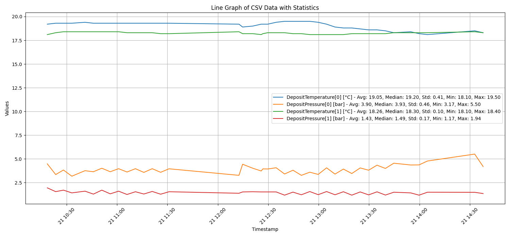

# CSV Consolidation and Analysis Tool

## Overview

This tool consolidates multiple CSV files into a single file and generates a line graph using the timestamp as the x-axis. It includes statistical analysis such as averages, medians, standard deviations, minimums, and maximums for each numeric column.

## Requirements

- Python 3.x
- Libraries: pandas, matplotlib
- tkinter for the GUI directory selection

## Installation

To install required libraries, run:

```bash
pip install -r requirements.txt
```

This command will install all necessary libraries as listed in the `requirements.txt` file.

## Usage

1. **Running the Script**: Execute the script in a Python environment. A GUI window will open for directory selection.

2. **Selecting Directory**: Use the GUI to select the directory containing your CSV files.

3. **Output**:
   - The script will create a consolidated CSV file named `corrected_consolidated.csv` in the same directory, with data entries separated by commas.
   - A line graph with statistical data for each numeric column will be displayed.

## Features

- **CSV Consolidation**: Combines multiple CSV files (semicolon-separated) into a single comma-separated CSV file.
- **Graph Generation**: Generates a line graph with the timestamp on the x-axis.
- **Statistical Analysis**: Calculates and displays mean, median, standard deviation, minimum, and maximum for each numeric column in the graph.



## Notes

- Ensure all CSV files have the same structure and headers.
- The script expects the 'Timestamp' column to be in a specific format. Adjust the `date_format` in the script if necessary.

## Troubleshooting

- **Timestamp Format**: If the graph does not display correctly, ensure the timestamp format in the script matches the format in your CSV files.
- **Encoding Errors**: If you encounter encoding errors, check if your CSV files have a consistent encoding format.

## License

This tool is open-source and free to use.
